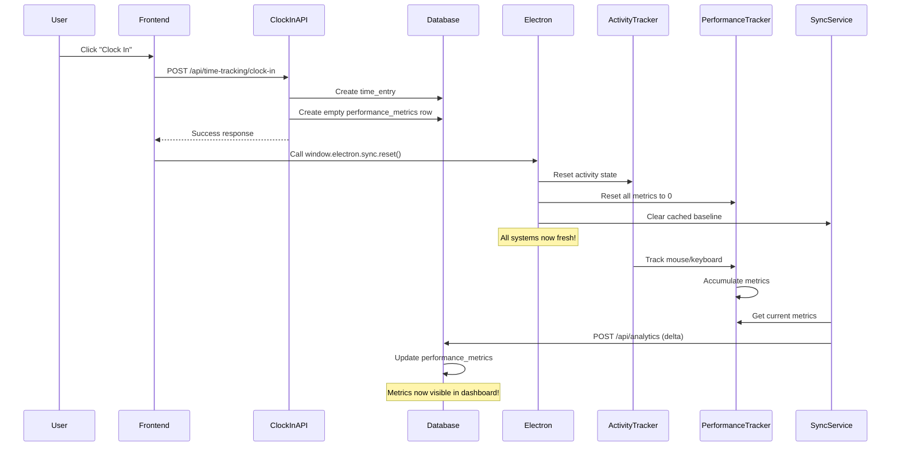

# 🔧 Analytics Tracking Fix - No More PC Restart Required!

## Problem Summary

Previously, analytics tracking (mouse movements, clicks, keystrokes) would stick at 0 after clocking in, requiring a PC restart to work properly. This happened because:

1. **Stale Metrics State**: The Electron app's tracking services were initialized on app launch, but they cached metrics state that didn't reset when you clocked in
2. **Delta Calculation Issue**: The sync service calculates deltas (differences) to avoid double-counting, but the baseline snapshot wasn't clearing on clock-in
3. **Timestamp Misalignment**: Activity tracking timestamps weren't resetting, causing timing issues

## The Solution

### What We Fixed

#### 1. **Enhanced Sync Service Reset** (`electron/services/syncService.js`)
```javascript
reset() {
  // Clears the last synced metrics snapshot
  this.lastSyncedMetrics = null  // Forces next sync to be "first sync"
  this.retryCount = 0
  this.lastSyncTime = null
  
  // Triggers immediate sync after 2 seconds to establish new baseline
  setTimeout(() => this.sync(), 2000)
}
```

**Why this matters**: When you clock in, the sync service now completely forgets its previous state and treats the next sync as a fresh start, sending all metrics as-is rather than as deltas.

#### 2. **Complete Performance Tracker Reset** (`electron/services/performanceTracker.js`)
```javascript
resetMetrics() {
  // Reinitialize all metrics to zero
  this.metrics = this.initializeMetrics()
  
  // Clear tracked state
  this.activeApps.clear()
  this.visitedUrls.clear()
  
  // Reset all timestamps
  this.sessionStartTime = Date.now()
  this.lastActivityTime = Date.now()
  this.lastIdleCheck = Date.now()
}
```

**Why this matters**: Ensures all counters, sets, and timestamps are completely refreshed when you clock in.

#### 3. **Activity Tracker State Reset** (`electron/activity-tracker.js`)
```javascript
reset() {
  // Reset activity timestamp
  this.lastActivityTime = Date.now()
  this.lastMouseTrack = 0
  
  // Clear inactivity state
  this.dialogShown = false
  this.inactivityStartTime = null
  
  // Close any open inactivity dialogs
  if (this.inactivityDialog) {
    this.inactivityDialog.close()
  }
}
```

**Why this matters**: Ensures the activity detection system starts fresh with current timestamps.

#### 4. **Coordinated Reset in Main Process** (`electron/main.js`)
```javascript
ipcMain.handle('reset-metrics', () => {
  // Reset ALL three systems in coordination:
  performanceTracker.resetMetrics()
  syncService.reset()
  activityTracker.reset()
  
  return { success: true, message: 'All tracking systems reset successfully' }
})
```

**Why this matters**: Ensures all systems reset together when you clock in, preventing state mismatches.

#### 5. **Enhanced Clock-In Logging** (`hooks/use-time-tracking-websocket.ts`)
```typescript
if (data.success) {
  // Call Electron reset with detailed logging
  const resetResult = await window.electron.sync.reset()
  console.log('✅ Local metrics and sync state reset successfully')
  console.log('🎯 Activity tracking will now count from zero')
}
```

**Why this matters**: Provides clear console logs so you can verify the reset is happening correctly.

## How It Works Now

### Clock-In Flow (No Restart Needed!)



## Testing the Fix

### 1. Check Console Logs

When you clock in, you should see these logs in the **Electron console** (View → Toggle Developer Tools):

```
✅ [Clock-In] Clock-in successful, now resetting Electron tracking...
🔄 [Clock-In] Calling window.electron.sync.reset()...
🔄 [Main] ============================================================
🔄 [Main] CLOCK-IN DETECTED - RESETTING ALL TRACKING SYSTEMS
🔄 [Main] ============================================================
🔄 [PerformanceTracker] RESETTING PERFORMANCE METRICS
🔄 [SyncService] RESETTING SYNC STATE (CLOCK-IN DETECTED)
🔄 [ActivityTracker] RESETTING ACTIVITY TRACKER STATE
🔄 [Main] ALL SYSTEMS RESET - READY FOR NEW SESSION
✅ [Clock-In] Local metrics and sync state reset successfully
🎯 [Clock-In] Activity tracking will now count from zero
```

### 2. Verify Tracking is Working

1. **Clock in** through the app
2. Wait 2-3 seconds
3. **Move your mouse, click, and type** some keys
4. Open the **Performance Dashboard**
5. Check if the **Debug Panel** shows live events
6. Wait 10 seconds for sync
7. **Refresh** the dashboard
8. Metrics should now show non-zero values!

### 3. Use the Debug Panel

On the Performance Dashboard, click **"Show Debug"** to see real-time activity events:

- 🟢 **Green** = Keyboard events
- 🟣 **Purple** = Mouse clicks
- 🔵 **Blue** = Mouse movements

If you see events appearing here but metrics staying at 0, there's a sync issue. Check the console for sync errors.

## Common Issues & Solutions

### Issue 1: "Electron sync reset not available" Warning

**Symptom**: You see this warning in console when clocking in:
```
⚠️ [Clock-In] Electron sync reset not available
```

**Cause**: You're running in a regular browser, not the Electron app.

**Solution**: Make sure you're using the **Electron desktop app**, not the web browser version.

---

### Issue 2: Metrics Still Showing 0 After Clock-In

**Symptom**: After clocking in and performing activity, metrics stay at 0.

**Cause**: Possible issues:
- Activity tracker not receiving events (antivirus blocking)
- Sync service not running
- User not clocked in properly

**Solution**:
1. Check console logs for reset confirmation
2. Open Performance Dashboard → Show Debug
3. Verify events are appearing in the debug panel
4. Check console for sync errors (401 Unauthorized, etc.)
5. If no events in debug panel → antivirus might be blocking uiohook
6. Try disabling antivirus temporarily or add app to whitelist

---

### Issue 3: Sync Errors (401 Unauthorized)

**Symptom**: Console shows:
```
⚠️ [SyncService] Warning: No session cookie found
❌ [SyncService] Sync failed with status: 401
```

**Cause**: Session cookie not found by Electron.

**Solution**:
1. Try logging out and logging back in
2. Restart the Electron app
3. Check that cookies are enabled
4. If persistent, check the auth.ts cookie configuration

---

## Technical Details

### Why Restart Used to Work

When you restart your PC:
- Electron app starts fresh with no cached state
- `lastSyncedMetrics = null` naturally
- First sync after restart is always treated as "first sync"
- Delta calculation starts clean

### Why It Now Works Without Restart

The reset handler achieves the same clean state without restarting:
- Explicitly sets `lastSyncedMetrics = null`
- Clears all cached timestamps and counters
- Triggers immediate re-sync to establish new baseline
- All three tracking systems coordinate their reset

## Files Changed

- ✅ `electron/services/syncService.js` - Enhanced reset with immediate sync
- ✅ `electron/services/performanceTracker.js` - Complete state reset
- ✅ `electron/activity-tracker.js` - Added reset method
- ✅ `electron/main.js` - Coordinated reset handler
- ✅ `hooks/use-time-tracking-websocket.ts` - Enhanced logging

## Need Help?

If tracking still isn't working after this fix:

1. **Check the console logs** - Look for the reset confirmation messages
2. **Verify activity events** - Use the Debug Panel to confirm uiohook is working
3. **Check clock-in status** - Make sure you're actually clocked in (check time entry)
4. **Restart the app** - As a last resort, restart the Electron app (not the whole PC!)

---

**Status**: ✅ **Fixed** - Analytics tracking now resets properly on clock-in without requiring PC restart!


