# 💾 Data Persistence Fix - Logout/Login Data Continuity

## Problem Summary

When users logged out and logged back in, their performance metrics (mouse clicks, keystrokes, etc.) would reset to 0 instead of showing the accumulated totals from the database. This made it appear that all their work data was lost.

### Root Cause

The Performance Dashboard was displaying **Electron's local metrics** instead of **database values**:

```typescript
// BEFORE (BROKEN):
const displayMetrics = (isElectron && liveMetrics) 
  ? { ...liveMetrics, screenshotCount: todayMetrics?.screenshotCount || 0 }
  : todayMetrics
```

**What was happening:**

1. **Electron tracked metrics locally** in memory (mouseClicks, keystrokes, etc.)
2. **Synced deltas to database** every 10 seconds
3. **Database accumulated the totals** correctly
4. **BUT: Dashboard showed local Electron metrics**, not database values
5. **On logout**: Electron's memory cleared
6. **On login**: Electron started fresh from 0
7. **Result**: Dashboard showed 0, even though database had all the data! 😱

## The Solution

Changed the dashboard to **always use database values** as the source of truth:

```typescript
// AFTER (FIXED):
const displayMetrics = todayMetrics  // Always use database values
```

### Why This Works

The database is the **single source of truth**:

1. ✅ **Electron syncs to database** every 10 seconds
2. ✅ **Dashboard fetches from database** every 10 seconds
3. ✅ **Database persists forever** (survives logout/login/restarts)
4. ✅ **Display is near real-time** (10-second delay max)

## Data Flow Diagram

### Before Fix (Data Loss on Logout)


### After Fix (Data Persists Forever)

```mermaid
sequenceDiagram
    participant User
    participant Electron
    participant Database
    participant Dashboard
    
    Note over User,Dashboard: Session 1: 9:00 AM - 10:00 AM
    
    User->>Electron: Perform actions (100 clicks)
    Electron->>Electron: Track locally: 100 clicks
    Electron->>Database: Sync delta: +100 clicks
    Database->>Database: Store: 100 clicks ✅
    Dashboard->>Database: Fetch metrics
    Database->>Dashboard: Return: 100 clicks ✅
    
    User->>User: LOGOUT
    Electron->>Electron: Memory cleared: 0 clicks
    
    Note over User,Dashboard: Session 2: 10:30 AM - 11:00 AM
    
    User->>User: LOGIN
    User->>Electron: Perform actions (50 more clicks)
    Electron->>Electron: Track locally: 50 clicks
    Electron->>Database: Sync delta: +50 clicks
    Database->>Database: Store: 100 + 50 = 150 clicks ✅
    Dashboard->>Database: Fetch metrics
    Database->>Dashboard: Return: 150 clicks ✅
    
    Note over Dashboard: Shows: 150 clicks ✅ CORRECT!
```



## How the System Works Now

### Electron's Role

**Purpose**: Capture user activity in real-time

- Tracks mouse movements, clicks, keystrokes
- Accumulates locally in memory
- **Syncs deltas** (not totals) to database every 10 seconds
- Resets on app restart/logout (this is OK!)

### Database's Role

**Purpose**: Permanent storage and source of truth

- Receives delta updates from Electron
- **Accumulates totals** for the day/shift
- Persists forever (survives everything)
- Provides data to dashboard API

### Dashboard's Role

**Purpose**: Display current totals

- Fetches from `/api/analytics` every 10 seconds
- Shows **database values** (not Electron's local values)
- Updates near real-time (10-second delay)
- Displays correct totals even after logout/login

## Testing the Fix

### Test 1: Basic Data Persistence

1. **Login** to the Electron app
2. **Clock in**
3. **Perform some activity** (click, type, move mouse)
4. **Wait 20 seconds** for sync + refresh
5. **Check Performance Dashboard** - should show activity ✅
6. **Logout**
7. **Login again**
8. **Check Performance Dashboard** - should show same numbers ✅

### Test 2: Accumulation Across Sessions

1. **Login and clock in**
2. **Perform 100 mouse clicks**
3. **Wait 20 seconds**
4. **Note the total** (e.g., "150 clicks")
5. **Logout**
6. **Login again**
7. **Perform 50 more clicks**
8. **Wait 20 seconds**
9. **Check total** - should be ~200 clicks ✅

### Test 3: Real-Time Updates Still Work

1. **Login and clock in**
2. **Open Performance Dashboard**
3. **Perform activity** while watching dashboard
4. **Wait 10-15 seconds**
5. **Dashboard should update** with new totals ✅

## Why Not Use Live Metrics?

You might ask: "Why not show Electron's live metrics for instant updates?"

### The Problem with Live Metrics

If we show live metrics + database:

```typescript
// This seems good but has a fatal flaw:
mouseClicks: (database.mouseClicks) + (electron.liveClicks)
```

**Timeline:**
- 10:00 AM: User clicks 100 times
- 10:00:10 AM: Electron syncs +100 to database (DB now has 100)
- Display shows: 100 (DB) + 100 (Electron) = 200 ❌ **DOUBLE COUNTING!**

We'd need to:
1. Track when we last fetched from database
2. Reset Electron's local counter after each database fetch
3. Complex synchronization logic
4. Prone to race conditions and bugs

### The Solution: Database as Single Source

By using only database values:
- ✅ **No double counting**
- ✅ **No complex sync logic**
- ✅ **Reliable and simple**
- ✅ **10-second delay is acceptable**
- ✅ **Data persists forever**

## Performance Implications

### Update Frequency

- **Electron → Database**: Every 10 seconds (sync interval)
- **Database → Dashboard**: Every 10 seconds (fetch interval)
- **Max display delay**: ~20 seconds worst case
- **Typical delay**: ~10 seconds

### Why This Is Acceptable

For performance analytics:
- **10-second delay is imperceptible** for daily metrics
- **Accuracy is more important** than instant updates
- **Data integrity** is preserved
- **Works reliably** across sessions

## Edge Cases Handled

### ✅ User Logs Out Without Clocking Out

- Electron syncs data every 10 seconds while clocked in
- Last sync captured ~10 seconds before logout
- Database has all data except last ~10 seconds
- **Minimal data loss** (<10 seconds of activity)

### ✅ App Crashes

- Same as logout - last sync captured data
- Database retains everything up to last sync
- **Recovery automatic** on restart

### ✅ Multiple Logins Same Day

- Each login/logout cycle preserves data
- Database accumulates across all sessions
- **Total for day is correct**

### ✅ Clock Out Then Clock In Again

- Each shift creates new performance_metrics row
- Previous shift data preserved in database
- **No data conflicts**

## Files Changed

- ✅ `components/performance-dashboard.tsx` - Changed to use database values

## Summary

### Before Fix
- ❌ Data appeared to be lost on logout/login
- ❌ Users confused about missing metrics
- ❌ False impression of system malfunction

### After Fix
- ✅ Data persists across logout/login
- ✅ Database is single source of truth
- ✅ Near real-time updates (10-second delay)
- ✅ Simple, reliable architecture
- ✅ No double-counting issues

---

**Status**: ✅ **Fixed** - Performance data now persists correctly across logout/login!

## Additional Notes

### For Developers

If you need truly instant updates (< 1 second), consider:

1. **WebSocket push updates** from database to dashboard
2. **Server-Sent Events (SSE)** for real-time data streaming
3. **Keep using database as source** - just push updates instead of polling

**Do NOT** go back to using Electron's local metrics - that breaks persistence!

### For Admins

If users report "missing data" after logout/login:

1. **Check database** - data should be there
2. **Wait 10-20 seconds** for dashboard to refresh
3. **Verify sync service** is running in Electron
4. **Check console logs** for sync errors

The data is NOT lost - it's in the database. The dashboard just needs to fetch it.

