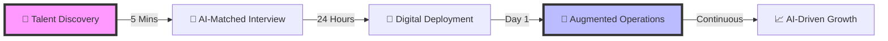
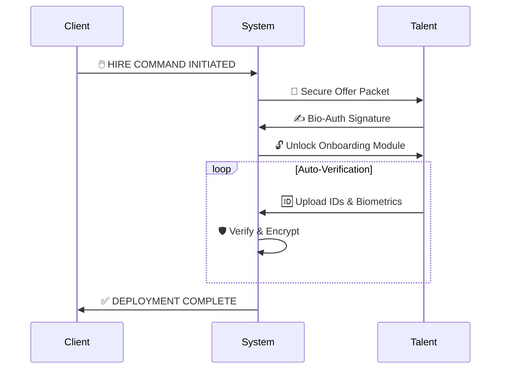
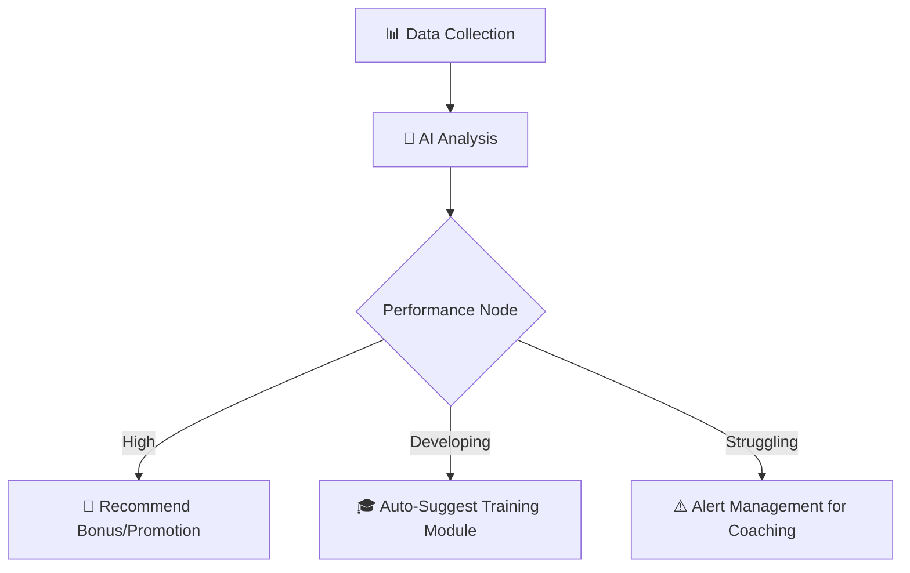

# 🚀 THE SHOREAGENTS OS: OPERATING SYSTEM FOR THE FUTURE OF WORK
## 🧬 Human Talent × Artificial Intelligence × Neural Collaboration

**System Version:** 2025.11 (Next-Gen)  
**Status:** 🟢 SYSTEMS OPERATIONAL  
**Mission:** Upgrade the Global Workforce

---

## 🔮 The Vision
**Stop Managing People. Start Managing Outcomes.**

ShoreAgents is not a BPO. It is a **Workforce Operating System** that merges elite Filipino talent with agentic AI, real-time telemetry, and neural collaboration tools.

We don't just "hire staff." We deploy **Augmented Work Units**—humans enhanced by AI, integrated into your business instantly.

---

## 📺 THE SYSTEM VISUALIZED

### ⚡ The "Zero-Friction" Deployment Loop

> *[🎥 ANIMATION: Fast-paced montage showing a user clicking "Hire", the system processing, and the staff member appearing on dashboard instantly]*

---

## 📍 PHASE 1: INTELLIGENT DISCOVERY
### "Precision Matching via Neural Filters"

Forget reading resumes. Our system analyzes **Data Points**, not just job history.

> *[🎥 ANIMATION: User scrolling through "Cards" of talent. Hovering shows stats, personality graph, and skill radar chart expanding]*

### 🧬 The Talent Matrix
- **Skill Radar:** 📊 Visual breakdown of capabilities
- **Psychometric Sync:** 🧠 MBTI & Work-style matching
- **Voiceprint Analysis:** 🗣️ English fluency scoring
- **Tech Stack Compatibility:** 💻 Instant tool matching

**⏱️ Deployment Time:** 5 Minutes

---

## 🚀 PHASE 2: HYPER-SPEED ONBOARDING
### "From Contract to Cloud in 24 Hours"

Manual paperwork is obsolete. Our **Digital Airlock** handles everything.

> *[🎥 ANIMATION: Progress bar filling up rapidly as documents "fly" into the system, turning green checkmarks. Final screen: "UNIT READY"]*

---

## 🦾 PHASE 3: AUGMENTED OPERATIONS
### "The Cyborg Workforce"

Your staff are not alone. They are paired with **SA-AI**, a neural companion that knows your business.

### 🧠 SA-AI (The Neural Companion)
> *[🎥 ANIMATION: Split screen. Left: Staff typing. Right: AI suggesting code/text, finding files, and reminding of deadlines]*

- **RAG Memory Core:** 📚 Instantly recalls every SOP, Policy, and Brand Guideline.
- **Predictive Tasking:** 🔮 "You usually send this report at 5 PM. Shall I draft it?"
- **Agentic Actions:** ⚡ "I've created the Jira ticket and Slack message for you."
- **Emotional Intelligence:** ❤️ "You've been working hard, James. Great job on that design!"

### 👁️ Telemetry & Visibility (The HUD)
**"God Mode" for Management.**

> *[🎥 ANIMATION: Dashboard view. Live map of staff. "Green dots" pulsing for active staff. Live activity graphs flowing like stock tickers]*

| Metric | Description | Visibility |
|:---|:---|:---|
| **Productivity Velocity** | Real-time output tracking | 🟢 Live |
| **App Telemetry** | Exact tool usage heatmaps | 🟢 Live |
| **Focus Flow** | Deep work vs. Distraction analysis | 🟢 Live |
| **Visual Proof** | Periodic screen capture verification | 📸 Snapshot |

---

## ⚡ PHASE 4: NEURAL COLLABORATION
### "Work at the Speed of Thought"

Communication shouldn't be a separate app. It's woven into the work itself.

> *[🎥 ANIMATION: A Task card opens. Staff mentions Client. Client replies from mobile. Reaction emojis explode on screen. Task drags to "Done".]*

### 🔗 Universal Synapse
- **Context-Aware Chat:** 💬 Talk *inside* the task, ticket, or document.
- **Reaction Protocol:** 🔥🚀👍 Instant feedback loops.
- **Social Grid:** 🌐 A lively feed of wins, updates, and culture. Remote, but connected.

---

## 📈 PHASE 5: ALGORITHMIC GROWTH
### "Self-Optimizing Teams"

The system learns. It improves. It optimizes.

> *[🎥 ANIMATION: Performance graph animating over 6 months. Green line going up. "Level Up" badge appearing on staff profile.]*

---

## 💎 THE TECH STACK ADVANTAGE

### 🛡️ The ShoreAgents Core
- **Architecture:** ☁️ Cloud-Native Serverless
- **Security:** 🔐 Enterprise-Grade Encryption
- **AI Model:** 🧠 GPT-4o + Claude 3.5 Sonnet Integration
- **Tracking:** 👁️ Custom Electron Telemetry Engine
- **Search:** 🔍 Vector-Based Semantic Recall (RAG)

---

## 🏆 WHY UPGRADE TO SHOREAGENTS?

### 📉 The Old World (Traditional BPO)
- **Latency:** 🐢 4+ Weeks lag time
- **Blindspots:** 🌑 Zero visibility
- **Analog:** 📠 Manual processes
- **Static:** 🗿 No AI integration

### 🚀 The New World (ShoreAgents OS)
- **Instant:** ⚡ 3-Day Deployment
- **Transparent:** 👁️ 100% Visibility
- **Digital:** 📲 Automated workflows
- **Augmented:** 🦾 AI-Enhanced Humans

---

## 🔮 FUTURE ROADMAP: "PROJECT AGENTIC"

> *System Loading...* 
> `[██████████░░] 80%`

- **🗣️ Holo-Sync:** Real-time voice translation & transcription.
- **🤖 Auto-Pilot:** AI that performs repetitive tasks autonomously (Tier 2 Automation).
- **🔮 Predictive Scaling:** "Your workload is increasing 20%. Shall I interview 2 more staff?"

---

## 🏁 INITIALIZE SEQUENCE?

**Ready to upgrade your operating system?**

[ 🟢 **START DEPLOYMENT** ]  [ ⚪ **VIEW DEMO** ]

---
*ShoreAgents OS v2.0 // Powering the Future of Work*
