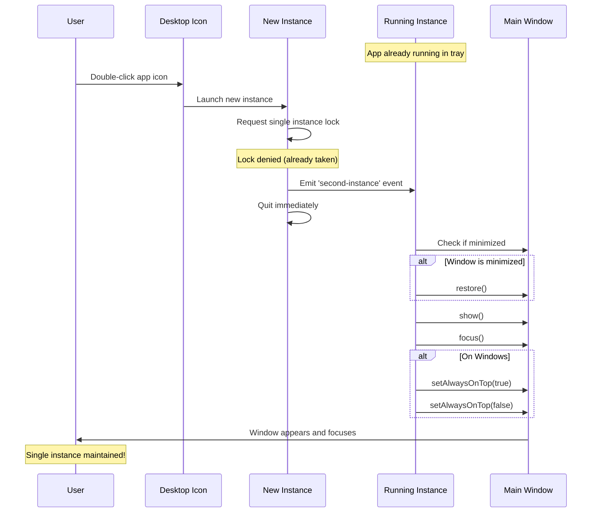

# 🔒 Single Instance Fix - No More Multiple App Windows!

## Problem Summary

Previously, when you clicked the app icon/shortcut while the app was already running in the background (system tray), it would try to open a **new instance** instead of restoring the existing window. This could lead to:

- Multiple app instances running
- Confusion about which window to use
- Duplicate tracking data
- Resource waste

## The Solution

### What We Fixed

#### 1. **Single Instance Lock** (`electron/main.js`)

Added Electron's single instance lock to ensure only one instance of the app can run at a time:

```javascript
const gotTheLock = app.requestSingleInstanceLock()

if (!gotTheLock) {
  // Another instance is already running, quit this new one
  app.quit()
} else {
  // This is the first instance
  app.on('second-instance', (event, commandLine, workingDirectory) => {
    // Someone tried to open the app again
    // Restore and focus the existing window instead
    if (mainWindow) {
      if (mainWindow.isMinimized()) {
        mainWindow.restore()
      }
      mainWindow.show()
      mainWindow.focus()
      
      // Bring to front on Windows
      if (process.platform === 'win32') {
        mainWindow.setAlwaysOnTop(true)
        mainWindow.setAlwaysOnTop(false)
      }
    }
  })
}
```

**Why this matters**: When you try to open the app while it's already running, the new instance immediately quits, and the existing window is restored and brought to focus.

#### 2. **Enhanced Tray Icon Click Behavior**

Improved the tray icon click handler to properly restore minimized windows:

```javascript
tray.on('click', () => {
  if (mainWindow) {
    if (mainWindow.isVisible() && !mainWindow.isMinimized()) {
      // Window is visible - hide it
      mainWindow.hide()
    } else {
      // Window is hidden or minimized - restore and show it
      if (mainWindow.isMinimized()) {
        mainWindow.restore()
      }
      mainWindow.show()
      mainWindow.focus()
      
      // Bring to front on Windows
      if (process.platform === 'win32') {
        mainWindow.setAlwaysOnTop(true)
        mainWindow.setAlwaysOnTop(false)
      }
    }
  }
})
```

**Why this matters**: Clicking the tray icon now properly restores minimized windows and brings them to the front.

#### 3. **Consistent "Show Dashboard" Behavior**

Updated all tray menu "Show Dashboard" options to use the same restore logic:

```javascript
{
  label: 'Show Dashboard',
  click: () => {
    if (mainWindow) {
      // Restore if minimized
      if (mainWindow.isMinimized()) {
        mainWindow.restore()
      }
      mainWindow.show()
      mainWindow.focus()
      
      // Bring to front on Windows
      if (process.platform === 'win32') {
        mainWindow.setAlwaysOnTop(true)
        mainWindow.setAlwaysOnTop(false)
      }
    }
  }
}
```

**Why this matters**: All ways to show the window now work consistently.

## How It Works Now

### Scenario 1: App is Running in Background (Tray)

**Before Fix:**
```
1. App running in tray
2. Click app icon on desktop/taskbar
3. ❌ New instance opens (now have 2 windows!)
4. Confusion ensues
```

**After Fix:**
```
1. App running in tray
2. Click app icon on desktop/taskbar
3. ✅ Existing window restores and focuses
4. Single instance maintained!
```

### Scenario 2: Window is Minimized

**Before Fix:**
```
1. App window minimized
2. Click tray icon
3. ❌ Window might not restore properly
```

**After Fix:**
```
1. App window minimized
2. Click tray icon
3. ✅ Window restores from minimized state
4. ✅ Window brought to front and focused
```

### Scenario 3: Window is Hidden

**Before Fix:**
```
1. App window hidden (in tray)
2. Right-click tray → "Show Dashboard"
3. ✅ Window shows but might not focus
```

**After Fix:**
```
1. App window hidden (in tray)
2. Right-click tray → "Show Dashboard"
3. ✅ Window shows, focuses, and comes to front
```

## Visual Flow



## Testing the Fix

### Test 1: Desktop Icon Double-Click

1. **Start the app** normally
2. **Minimize or hide** the window (to tray)
3. **Double-click the desktop icon** or shortcut
4. ✅ **Expected**: Existing window restores and focuses (no new window)
5. Check the **Developer Console** for this log:
   ```
   [Main] Second instance detected - restoring existing window
   ```

### Test 2: Tray Icon Click

1. **Start the app** normally
2. **Minimize the window** (Windows: click minimize button)
3. **Click the tray icon** in the system tray
4. ✅ **Expected**: Window restores from minimized state
5. Check the console for:
   ```
   [Main] Tray clicked - showing window
   ```

### Test 3: Tray Menu "Show Dashboard"

1. **Start the app** normally
2. **Hide the window** (click tray icon to hide)
3. **Right-click tray icon** → **"Show Dashboard"**
4. ✅ **Expected**: Window appears and focuses

### Test 4: Window Bring to Front (Windows)

1. **Start the app** normally
2. **Open another app** (e.g., browser) on top
3. **Click tray icon** or **desktop icon**
4. ✅ **Expected**: App window comes to front (above other windows)

## Platform-Specific Behavior

### Windows
- Uses `setAlwaysOnTop(true)` then `setAlwaysOnTop(false)` trick to bring window to front
- Single instance lock works perfectly
- Tray icon click toggle works as expected

### macOS
- Single instance lock works
- Uses native `activate` behavior
- Tray behavior may differ (macOS shows app in dock)

### Linux
- Single instance lock works
- May need additional window manager hints depending on desktop environment

## Common Issues & Solutions

### Issue 1: Multiple Instances Still Appearing

**Symptom**: You can still open multiple instances of the app.

**Cause**: Old version of the app is still installed/running.

**Solution**:
1. **Quit all instances** of the app
2. **Reinstall** or rebuild the app with the new code
3. **Launch only one instance**
4. Try opening again - should restore existing window

---

### Issue 2: Window Not Focusing on Windows

**Symptom**: Window shows but stays behind other windows.

**Cause**: Windows focus stealing prevention.

**Solution**: The fix includes the `setAlwaysOnTop` trick which should work. If still an issue:
1. Check Windows settings for "Focus Assist"
2. Try running the app as administrator (for testing)
3. Check if antivirus is interfering

---

### Issue 3: Tray Icon Not Responding

**Symptom**: Clicking tray icon does nothing.

**Cause**: Main window reference lost or destroyed.

**Solution**:
1. Check console for errors
2. Restart the app
3. Verify tray icon is properly created

---

## Development Notes

### Single Instance Lock Mechanism

The single instance lock is requested when the app starts:

```javascript
const gotTheLock = app.requestSingleInstanceLock()
```

- **If lock obtained** (first instance): App continues normally
- **If lock denied** (second instance): App quits immediately

When a second instance tries to start, the `second-instance` event fires in the first instance, allowing us to restore the window.

### Windows Focus Trick

On Windows, we use this trick to bring the window to front:

```javascript
mainWindow.setAlwaysOnTop(true)   // Temporarily pin on top
mainWindow.setAlwaysOnTop(false)  // Unpin (but stays focused)
```

This bypasses Windows' focus stealing prevention without permanently pinning the window.

### Why Check `isMinimized()`?

We need to check if the window is minimized separately because:
- A minimized window is technically "visible" (not hidden)
- But it needs `restore()` to actually appear
- Without this check, minimized windows wouldn't restore properly

## Files Changed

- ✅ `electron/main.js` - Added single instance lock and enhanced restore behavior

## Additional Features You Can Add

### 1. Notification on Second Instance Attempt

```javascript
app.on('second-instance', () => {
  // Show notification that app is already running
  const { Notification } = require('electron')
  new Notification({
    title: 'App Already Running',
    body: 'Bringing the window to focus...'
  }).show()
  
  // Then restore window...
})
```

### 2. Flash Window on Restore (Windows)

```javascript
mainWindow.once('focus', () => mainWindow.flashFrame(false))
mainWindow.flashFrame(true) // Flash until focused
```

### 3. Animate Window Restoration

```javascript
mainWindow.show()
mainWindow.setOpacity(0)
mainWindow.setOpacity(1) // Quick fade-in effect
```

## Summary

✅ **Single instance lock** prevents multiple app instances  
✅ **Enhanced restore behavior** properly handles minimized windows  
✅ **Consistent focus behavior** across all window-showing actions  
✅ **Platform-specific optimizations** for Windows bring-to-front  
✅ **Improved user experience** - app behaves as expected

---

**Status**: ✅ **Fixed** - Opening the app icon now restores the existing window instead of creating a new instance!

